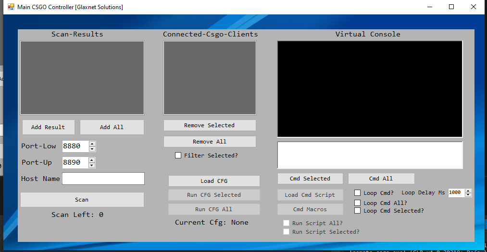

# csgo_controller

Allows you to control an instance of Counter-strike remotely
Simply parse -netconport to your launch options with the port number you wish to remotely control it from.

https://raw.githubusercontent.com/uk-classy/csgo_controller/main/image.png
